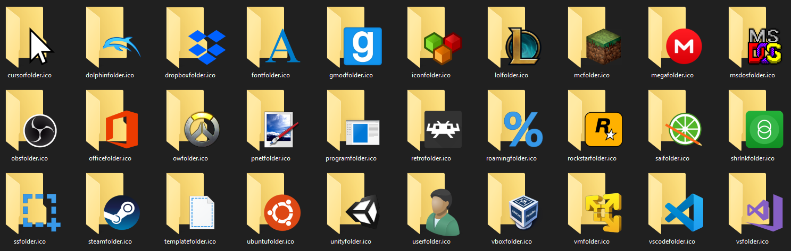
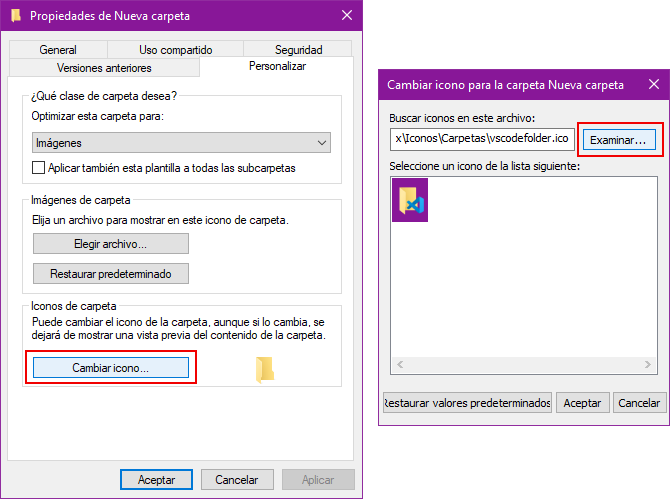

# Custom Folder Icons

Multipurpose folder icons for a variety of programs

---

## Use

In Windows, you can edit the icon of a folder.

Do _Right click_ > _Properties_ > _Customize_ > _Change icon_

Select _Browse_ and search for the icon you want. Select it and apply it.
