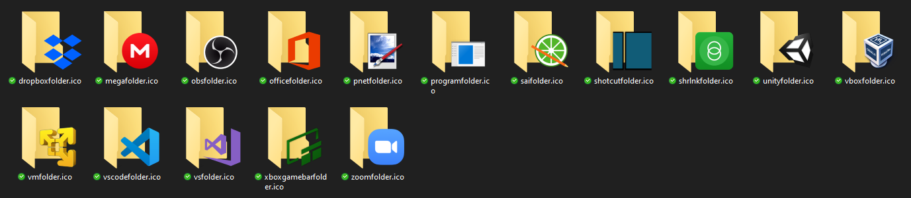

# Avaliable icons

* Games
  * `dolphinfolder` - Dolphin emulator
  * `gmodfolder` - Garry's Mod
  * `lolfolder` - League of Legends
  * `mcfolder` - Minecraft
  * `openrctfolder` - OpenRCT2
  * `owfolder` - Overwatch
  * `retrofolder` - Retroarch
  * `rockstarfolder` - Rockstar Games
  * `steamfolder` - Steam

---

* Programs
  * `dropboxfolder` - Dropbox
  * `megafolder` - MEGAsync
  * `obsfolder` - Open Broadcaster Software
  * `officefolder` - Microsoft Office
  * `pnetfolder` - Paint.net
  * `programfolder` - Generic program folder
  * `saifolder` - PaintTool SAI
  * `shotcutfolder` - Shotcut
  * `shrlnkfolder` - ASUS Share Link [DEPRECATED]
  * `unityfolder` - Unity
  * `vboxfolder` - VirtualBox
  * `vmfolder` - VMware
  * `vscodefolder` - Visual Studio Code
  * `vsfolder` - Visual Studio
  * `zoomfolder` - Zoom

---

* System
  * `cursorfolder` - Cursors folder
  * `fontfolder` - Fonts folder
  * `iconfolder` - Folder for icons
  * `msdosfolder` - MSDOS folder
  * `roamingfolder` - Reference to _AppData_ folder
  * `ssfolder` - Screenshots folder
  * `templatefolder` - Template files folder
  * `ubuntufolder` - Ubuntu folder
  * `userfolder` - User personal folder
  * `winfolder` - Windows folder
